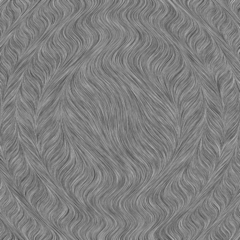
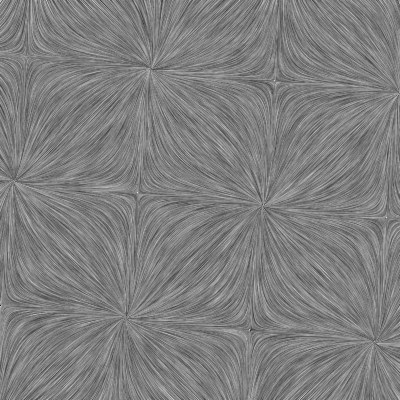
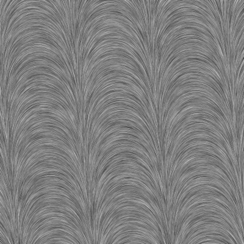
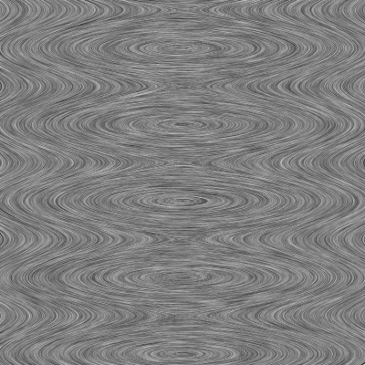
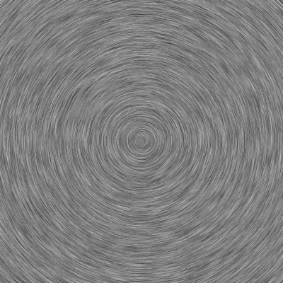
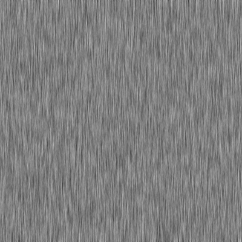

  

  

  

  

 

   

 

 

 

 

 


      
  other2_LIC.png  sink_LIC.png    source_LIC.png
  other_LIC.png     spiral_LIC.png


# LIC

[LIC (Line Integral Convolution)](https://en.wikipedia.org/wiki/Line_integral_convolution) is a [scientific visualization](https://en.wikipedia.org/wiki/Scientific_visualization) technique
* based on 
  * [texture](https://en.wikipedia.org/wiki/Texture_advection) ( not like geometry-based approaches such as arrow plots, streamlines, pathlines, timelines, streaklines, particle tracing, surface particles, stream arrows, stream tubes, stream balls, flow volumes and topological analysis)
  * integration
* a global method: all structural features of the vector field are displayed
* it has high computational expense ( in comparisen to low computational expense of a geometry-based methods) 
* basic LIC image (grayscale without color and animation) conveys the orientation of the field vectors, but it does not indicate their direction, the length of the vectors (or the strength of the field) 
* good for identifying critical points


It can be applied to: 
* steady planar [flow of fluids](https://en.wikipedia.org/wiki/Fluid_dynamics#Steady_versus_unsteady_flow) 
* a 2D static (=  time independent) vector field 


It shows:
* Streamlines = field lines of the fluid flow
* field lines of vector field


## Elements
* 2 inputs 
  * vector field
  * white noise 
* one output ( LIC image)


__First input:__
* [strong wind](http://www.zhanpingliu.org/research/flowvis/LIC/LIC.htm) or flow of the river
* steady flow = A flow that is not a function of time = time independent flow (as described in  [fluid dynamics](https://en.wikipedia.org/wiki/Fluid_dynamics#Steady_versus_unsteady_flow) )
* a 2D static (=  time independent) vector field  defined by a real-valued function F of two real variables x and y

```
  z = F(x,y)
```


__Second input:__
* White noise  
* [massless fine sand](http://www.zhanpingliu.org/research/flowvis/LIC/LIC.htm)   
* an input [grayscale](https://en.wikipedia.org/wiki/Grayscale) white noise texture

  


__Output: LIC image__
* [grayscale](https://en.wikipedia.org/wiki/Grayscale) image ( texture)
* which ["emulates what happens when a rectangular area of massless fine sand is blown by strong wind"](http://www.zhanpingliu.org/research/flowvis/LIC/LIC.htm)   
* ["provides a global dense representation of the flow, analogous to the resulting pattern of wind-blown sand"](http://www.zhanpingliu.org/research/flowvis/FlowVis.htm)
* throwing paint in a river. The result is a random striped texture where points along the same streamline tend to have similar color. 

   
  


## algorithm 
* ["It employs a low-pass filter to convolve an input noise texture along pixel-centered symmetrically bi-directional streamlines"](http://www.zhanpingliu.org/research/flowvis/LIC/LIC.htm) 
* Data Integration = The process of consolidating data from multiple sources
* line integral is an integral where the function to be integrated is evaluated along a curve


## code

Original repo : [Basic LIC by Chang Sha](https://github.com/pkuwwt/LIC/blob/master/basic_lic.c)

Here is it's c implementation of saddle-shaped field: 
```
void SyntheszSaddle(int  n_xres,  int  n_yres,  float*  pVectr)
{
  int i,j; 
  for(j = 0;  j < n_yres;  j ++) // y
     for(i = 0;  i < n_xres;  i ++) // x
  	{ 
   		int  index = (  (n_yres - 1 - j) * n_xres + i  )  <<  1;
   		pVectr[index    ] = - ( j / (n_yres - 1.0f) - 0.5f ); // y
   		pVectr[index + 1] =     i / (n_xres - 1.0f) - 0.5f;   // x 
     	} 
}

```

# See also
* [par_streamlines by Philip Rideout in 2019.](https://prideout.net/blog/par_streamlines/), [c code](https://github.com/prideout/streamlines_demo), 
* [2DFlowVisualization by Andres Bejarano](https://github.com/andresbejarano/2DFlowVisualization)
* [fluid-simulator by Linus Mossberg](https://github.com/linusmossberg/fluid-simulator)
* [LIC by M. Harper Langston](https://github.com/harperlangston/LIC)
* [LIC by  Dzhelil Rufat](https://github.com/drufat/licpy)
* [LIC by greenhol](https://github.com/greenhol/deLICious)
* [fieldplay by anvaka](https://github.com/anvaka/fieldplay)
* [Vector-Field-Topolgy-2D by zaman13](https://github.com/zaman13/Vector-Field-Topolgy-2D)
* [Line integral convolution algorithm for numpy arrays by Steffen Brinkmann](https://gitlab.com/szs/lic)
* [Line Integral Convolution for Flow Visualization by Han-Wei Shen](https://www.youtube.com/watch?v=qzFArXB3AFM)
* [ParaView: Line_Integral_Convolution](https://www.paraview.org/Wiki/ParaView/Line_Integral_Convolution)


__Vector field__
* [Field Play : Vector fields explorer. Made with WebGL, love and passion by Andrei Kashcha ( anvaka) ](https://github.com/anvaka/fieldplay)

# Git

create a new repository on the command line
```
echo "# LIC" >> README.md
git init
git add README.md
git commit -m "first commit"
git branch -M main
git remote add origin git@github.com:adammaj1/LIC.git
git push -u origin main
```
## Local repo
```
~/Dokumenty/lic/basic_lic/ 

```


## Subdirectory

```git
mkdir png
git add *.png
git mv  *.png ./png
git commit -m "move"
git push -u origin main
```
then link the images:

```txt
 

```

to overwrite

```
git mv -f 
```


## Github
* [GitHub Flavored Markdown Spec](https://github.github.com/gfm/)
* [md cheat sheet](http://mdcheatsheet.com/)
* [CommonMark Spec](https://spec.commonmark.org)
* [Markdown parser ](https://markdown-it.github.io/)
