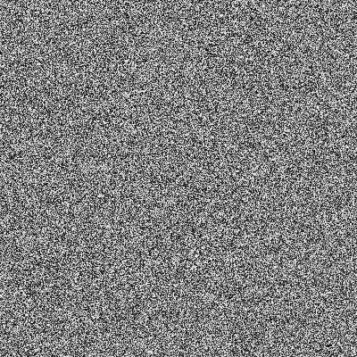
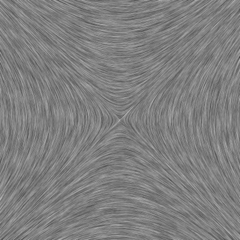

# LIC

Basic LIC by [Chang Sha](https://github.com/pkuwwt/LIC/blob/master/basic_lic.c)


White noise  ( sand ) 

  


LIC image ( result, output)  
   
  

# Git

create a new repository on the command line
```
echo "# LIC" >> README.md
git init
git add README.md
git commit -m "first commit"
git branch -M main
git remote add origin git@github.com:adammaj1/LIC.git
git push -u origin main
```
## Local repo
```
~/Dokumenty/mandelbrot_planes 
```


## Subdirectory

```git
mkdir png
git add *.png
git mv  *.png ./png
git commit -m "move"
git push -u origin main
```
then link the images:

```txt
 

```


## Github
* [GitHub Flavored Markdown Spec](https://github.github.com/gfm/)
* [md cheat sheet](http://mdcheatsheet.com/)
* [CommonMark Spec](https://spec.commonmark.org)
* [Markdown parser ](https://markdown-it.github.io/)
